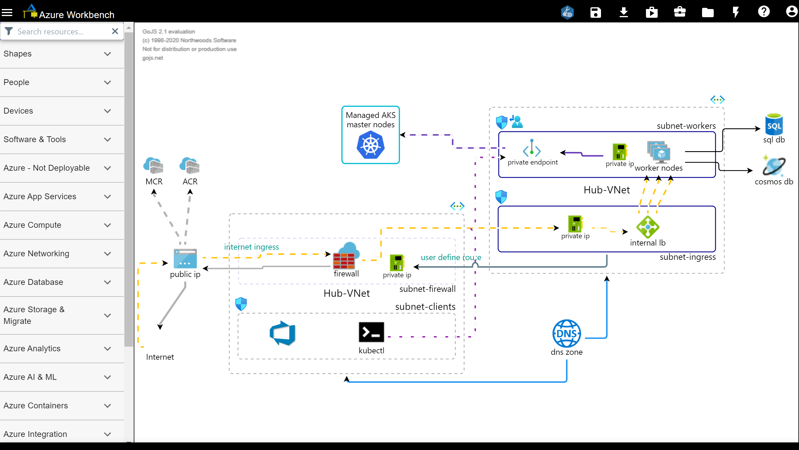
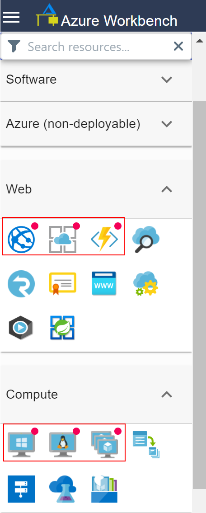
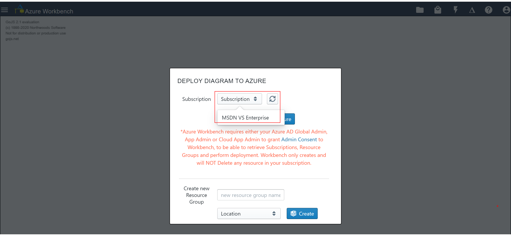
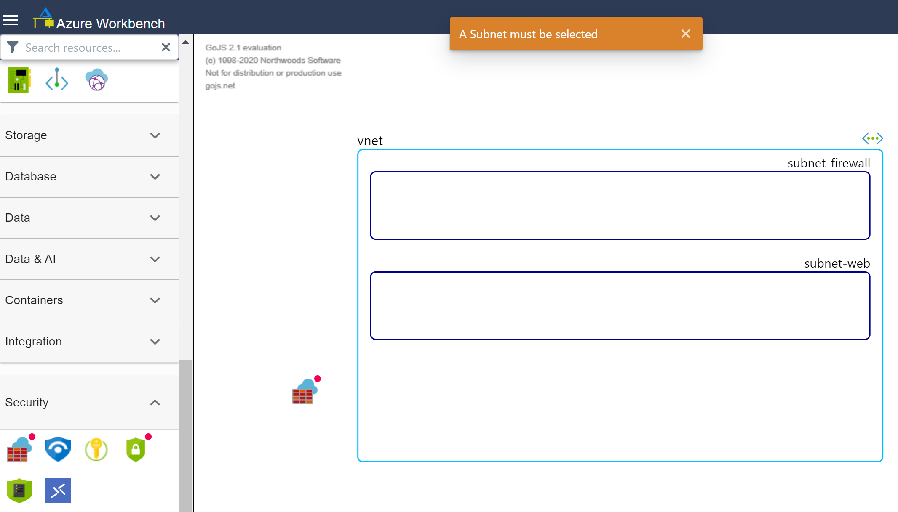
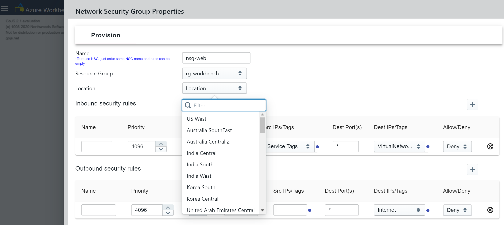
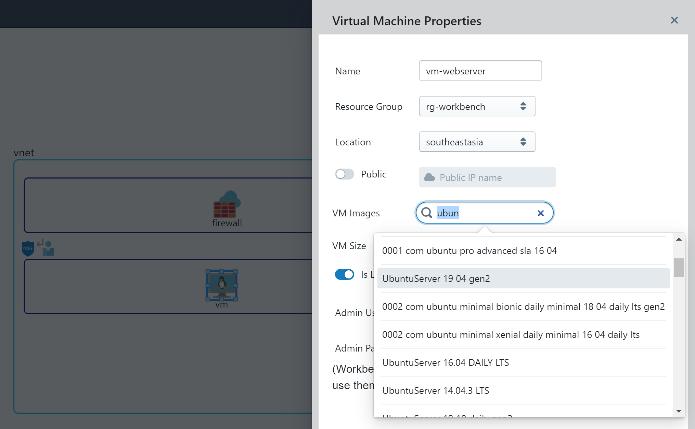

# Azure Workbench

Azure Workbench is a web tool that allows you to draw and share Azure diagrams. \
Visit [Workbench](https://www.azureworkbench.com/) and give it a try.

**Tutorial** \
You can find the following tutorial in Workbench.
* [Drawing Diagram](/tutorials/DrawingDiagram.md)
* [Shortcut Keys](/tutorials/ShotcurKeys.md)
* [Workbench Features]
* [Deploy Diagrams to Azure]

**Bugs and Feature Requests** \
Please create issues for bugs and feature requests, appreaciate your feedback.

## Drawing Diagrams

You can start drawing from scratch by dragging nodes from Resource Palette onto canvas or load diagrams from QuickStart Template \

## Deploy Diagrams to your Azure Subscriptions

Only resources marked with red badge are deployable. More resources will be made deployable.

    

 
 
 
 
 
 
 
 
 
 
 
 
 
 

**Prerequisite before deployment**   
Workbench requires either the Azure AD Global Admin, App Admin or Cloud App Admin \
to grant [admin consent](https://docs.microsoft.com/en-us/azure/active-directory/manage-apps/grant-admin-consent) so that Workbench can retrieve your Subscription, Resource Group and deploy diagrams to your Azure subscriptions.
After Sign-In and admin consent granted, select Subscription to deploy diagram.
  

**Share & discuss Azure deployment properties**  
Even if you don't wish to deploy diagrams, you can still use Workbench to share and discuss deployment properties  
to your team mates and customers. This can greatly reduce deployment errors and better improve implementation experience.  

 
  

 
 
 

