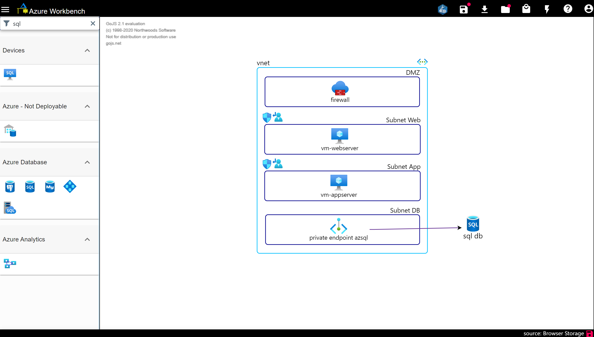
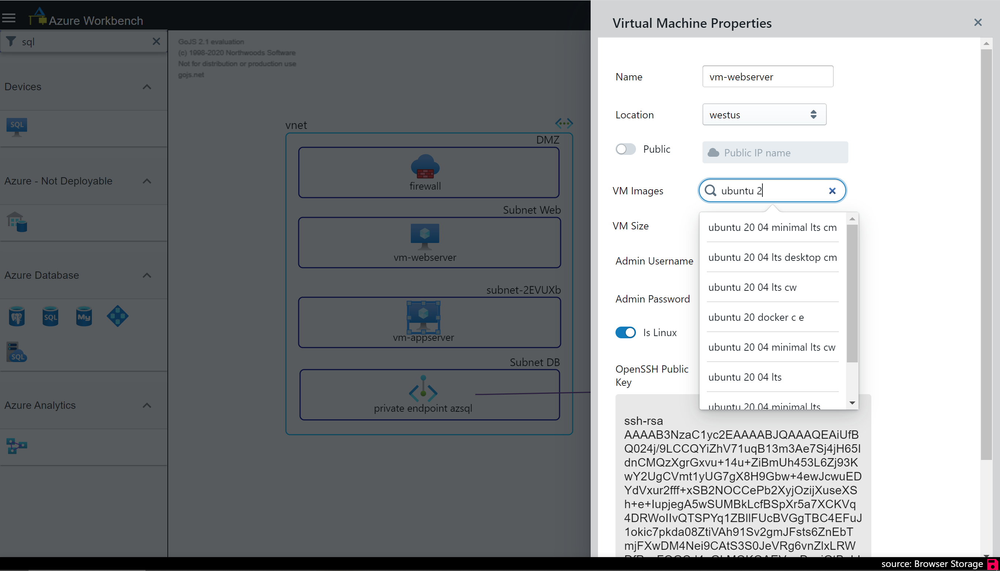
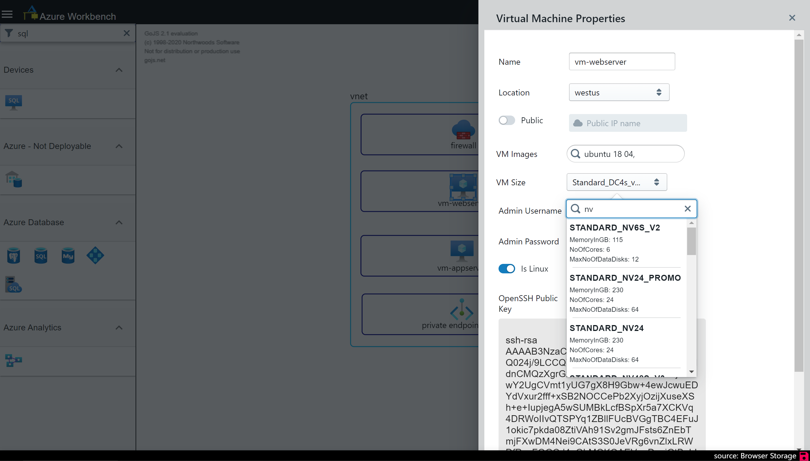
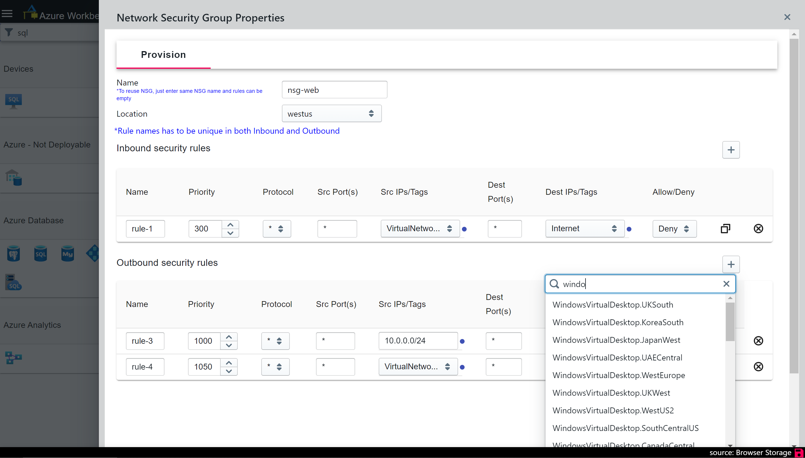
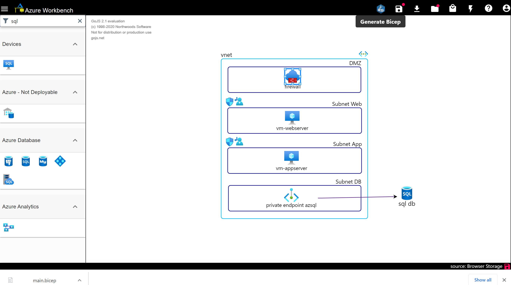
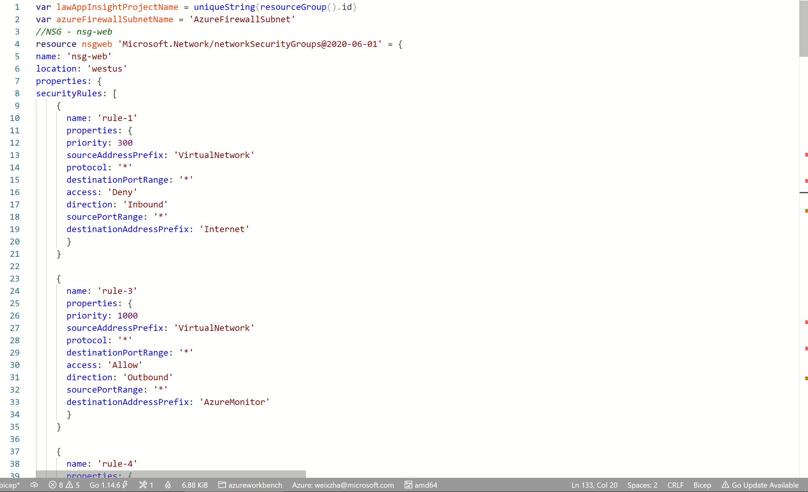
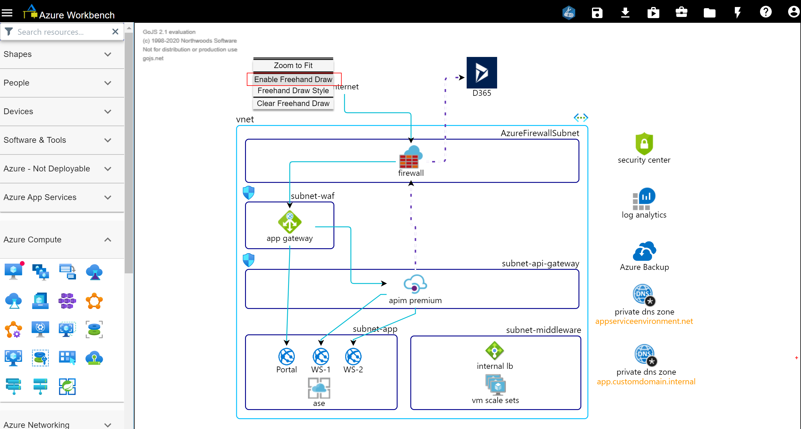
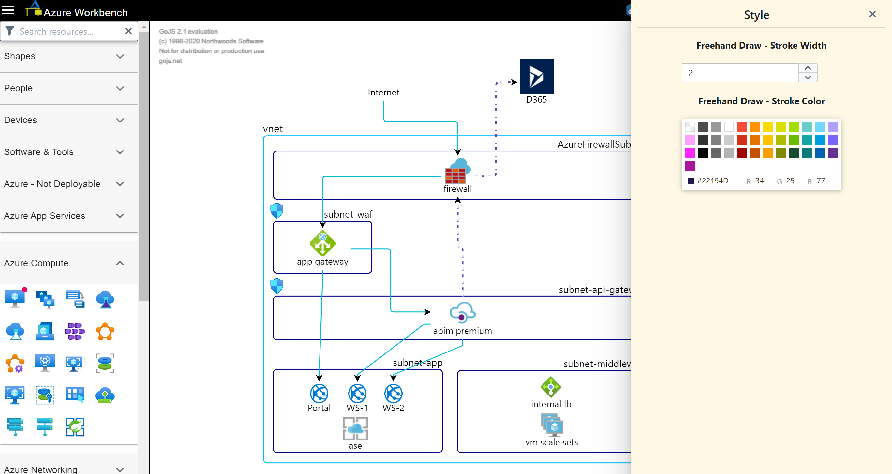

# Azure Workbench

[Azure Workbench](https://www.azureworkbench.com/) is a web based Azure diagram drawing tool with features including  
* Validate diagram against Azure resource deployment rules
* Generate Bicep template
* Save, load and share your diagrams 

**Tutorial**    

* [Shortcut Keys](/tutorials/ShortcutKeys.md)
* [My Space](/tutorials/MySpace.md)
* [Workbench Features](/tutorials/WorkbenchFeatures.md)
* [Drawing Diagram](/tutorials/DrawingDiagram.md)

**Bugs and Feature Requests**   

&nbsp;&nbsp;&nbsp;&nbsp;Please create issues for bugs and feature requests, appreciate your feedback.

## Drawing Diagram

You can start drawing diagram from scratch by dragging icons from Resource Palette on the left onto canvas or load diagrams from QuickStart Templates  
 

## Generate Bicep template
*Only resources marked with red badge are recognized in Bicep generation, more resources will be made available in coming weeks.  

    

 
Double-click each resource to show its Azure Property Pane and fill up the necessary Azure properties.   
These property values will be populated in Bicep template.
Below shows an example of filling up VM properties for VM image and size.
 

    

    

  
Example of NSG Inbound and Outbound rules input.
 

    

  
After entering all necessary Azure properties, click Generate Bicep
 

    

Bicep template generated  
 

    

  

## FreeHand mode  
Right-click to bring up context menu and select Enable FreeHand mode  
 

    

 
Upon enabling FreeHand mode, hitting Alt + S will bring up the FreeHand Style panel allowing you to change stroke color.  
<b>*When in FreeHand mode, its not able to open other shapes and Azure icons Style pane</b>
 

    

  
Draw in free hand
 

    

