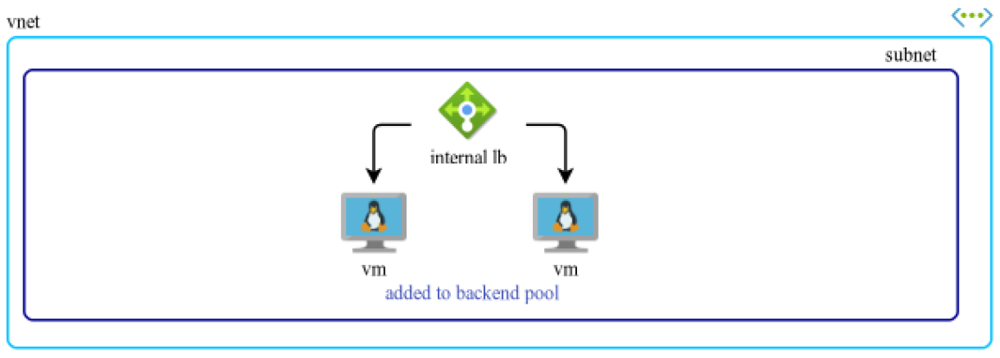
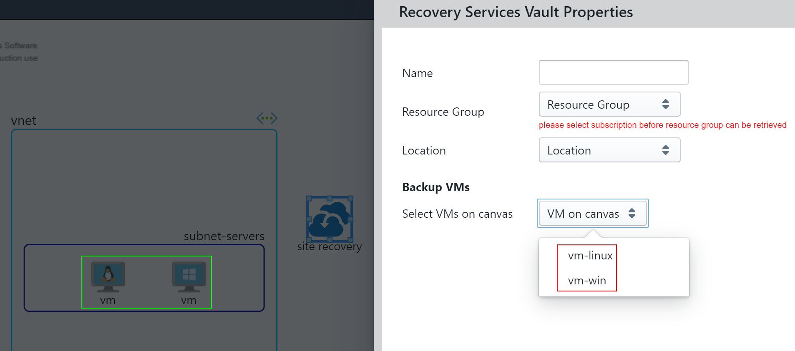

# Deploy Diagram to Azure

**Deployable Nodes**  

In Resource Palette, any node marked with a badge is deployable to your Azure subscription.  

**Load Balancer & Application Gateway**  

Any link connected between 1 or more VMs to a Load Balancer or App Gateway, simulating a "backend pool",  
these VMs will indeed be added into Backend Pools of Load Balancer and App Gateway.  

  

**Recovery Service Vault**  

In Recovery Service Vault Azure property panel, you can select VMs in diagrams to enable backup.  

  

**How to deploy?**  
* For each deployable node, double-click to open Azure Property Panel.  
  Make sure to fill up all Azure properties as no fields are optional  

* At header Toolbar, click on Azure menuitem, select Subscription and click Deploy  

_Azure Workbench must have Admin Consent granted by your Azure AD Global Admin  
before it can retrieve any Subscription, Resource Group perform deployment_