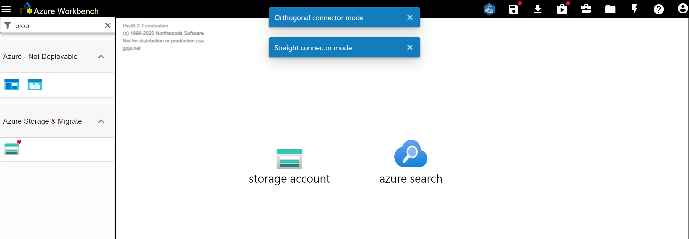
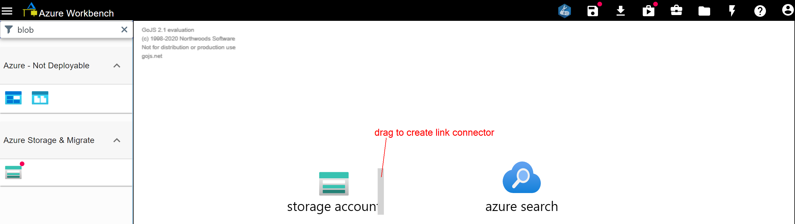
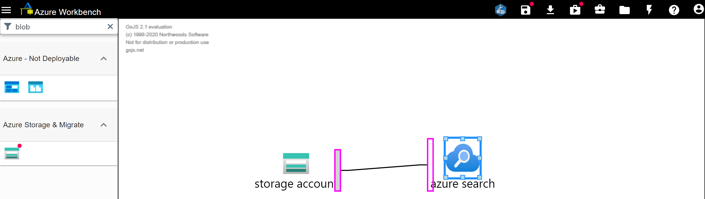
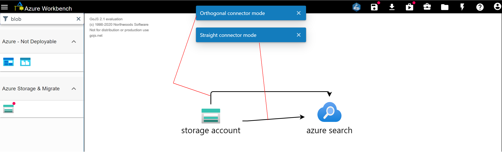

# Drawing Diagram

**Resource Palette**

The Resource Palette contains Connectors, Shapes, Picture Shapes and Azure resources  
that you can drag onto canvas to start drawing a diagram.  
Non-Azure nodes do not represent an Azure resource and therefore are not deployable to your Azure subscription.
Azure nodes are deployable to Azure and is marked with a red badge.  
More Azure nodes are made deployable weekly. 

**Draw Links to connect Icons**  
 
Hitting S key toggles between straight and orthogonal/angled links.  

    

 
As you hover over any of the 4 sides (north, south, east west) of any shapes and Icons, grey Ports will appear.
   

    

 
Click on the grey Port and drag to any Icon or shape you wish to draw a link to.
Hit S to toggle between straight and orthogonal/angled links.
   

    

   

    

  
**Copy & Paste**

  * **Copy whole or parts of diagram from another Browser tab**  
  * **Copy images from any snipping tool or print-screen**
  * **Copy images from any website**  
You can copy any image from other websites and do <b>"Ctrl V"</b> to paste on Canvas,  
in cases when you can't find an Node that suits your need
   

  * "Ctrl C" on one or multi-selected nodes and "Ctrl V" to duplicate selected nodes.
  * You can copy nodes from Microsoft Visio and do <b>"Ctrl V"</b> to paste on Canvas  

**Panning (move canvas view)**   
Hold on to Right-mouse button and move mouse to shift canvas view. Canvas has unlimited space for drawing  

**Zoom**  
Hold Ctrl + Mouse Wheel Up/Down to zoom in/out where cursor is

**Group & Ungroup**  
* To group  1 or more nodes, select 1 or more nodes and right-click _on canvas or on any node_ and click "Group"  
Or press "Ctrl+G" to group nodes.  

* To ungroup, simply select the group, right-click and click Ungroup.  
  Or press Ctrl+Shift+G.  

**Virtual Network: Add Subnet or Nat Gateway**  
Right-click on Virtual Network (drag from Resource Palette "Networking") and  
select "Add/Remove Subnet" or "Add/Remove NAT Gateway"  

**Subnet: Add Network Security Group or User-Defined Route**  
To add Network Security Group and User-Defined Route, right-click any Subnet  
and click on "Add/Remove NSG" or "Add/Remove Route Table.  

**Subnet: Add VNet-Injectable Services**  
[Certain services](https://docs.microsoft.com/en-us/azure/virtual-network/virtual-network-for-azure-services#services-that-can-be-deployed-into-a-virtual-network) like Kubernetes Service, Firewall, App Service Environment or API Management Premium must either resides in a shared or dedicated subnet.  
My colleagues and I like to call these services "VIR" or VNet-Injectable Services, Workbench validates them to make sure these VIR are indeed in subnets.  
_To add VIR to Subnet, click on Subnet, then drag the service onto canvas._
