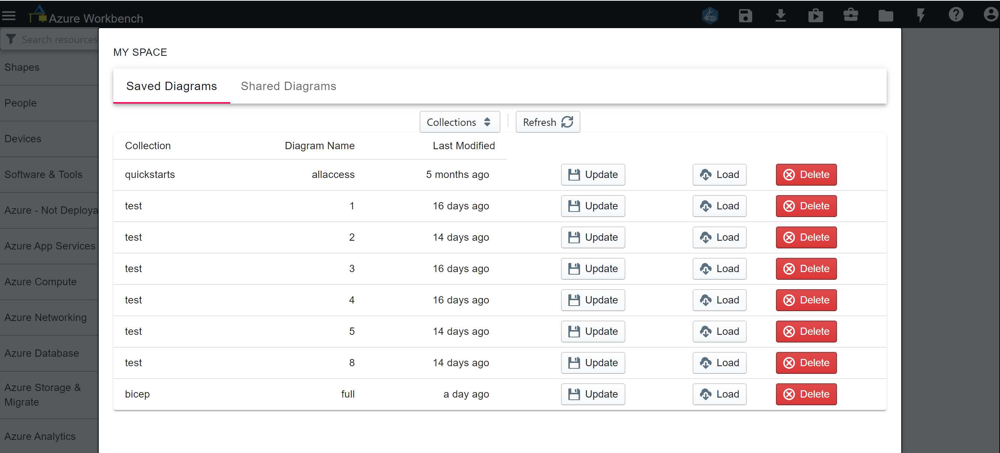
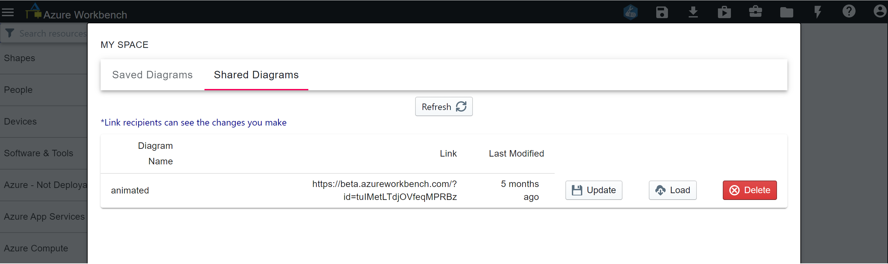

**Saved Diagrams**
 
My Space feature requires sign in.
* Update - Replace existing save diagram with the current diagram on canvas
* Load - Load saved diagram
* Delete - Delete saved diagram

    

**Shared Diagrams**  
 
Any diagram you shared using Share feature after signing in, Workbench auto tracks your shared diagram here.
You can load and update these shared diagrams, link recipients will be able to see your diagram changes without sharing a new link with them.
 

    

